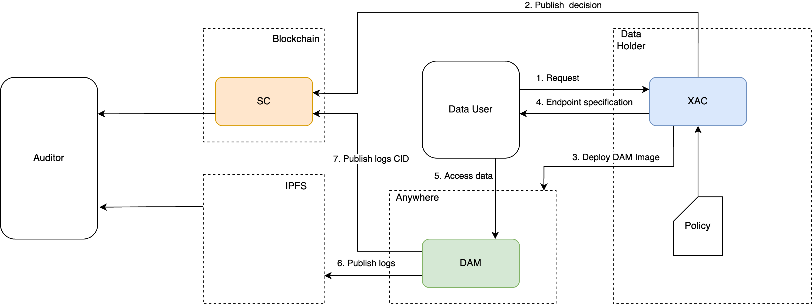

# Data-Sharing-Framework

## How to set up the environment

### Requirements
* NodeJs
* NPM
* Docker
* Ethereum Account

### Setup procedure
* Deploy the smart contract `SC.sol` on Ethereum network/testnet;
* Setup the environment file: 
  * rename the file `sample.env` to `.env`;
  * update its content with appropriate values;
* Install the dependencies by running `npm i`;
* Run an IPFS node;
* Run a Balana node by running `npm run balana`;
* Run the XAC server by running `npm start`;
* Run the worker process by running `npm run worker`.

## How test the prototype
Once the setup is completed, the XAC server exposes two endpoints:
* `POST /` to submit a request, i.e. ```{
  "sender": "H1",
  "technology": "SQL",
  "query": "SELECT * FROM GS1"
  }```;
* `GET /status/:request_id` to retrieve the status of the request processing.

Once the status of a request is `COMPLETED`, the DAM image can be deployed and queried.

## Architecture



|                XAC                 |                DAM                 |
|:----------------------------------:|:----------------------------------:|
|  |  |
